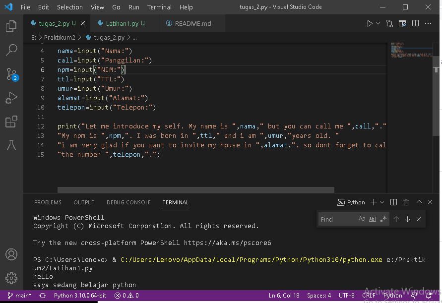
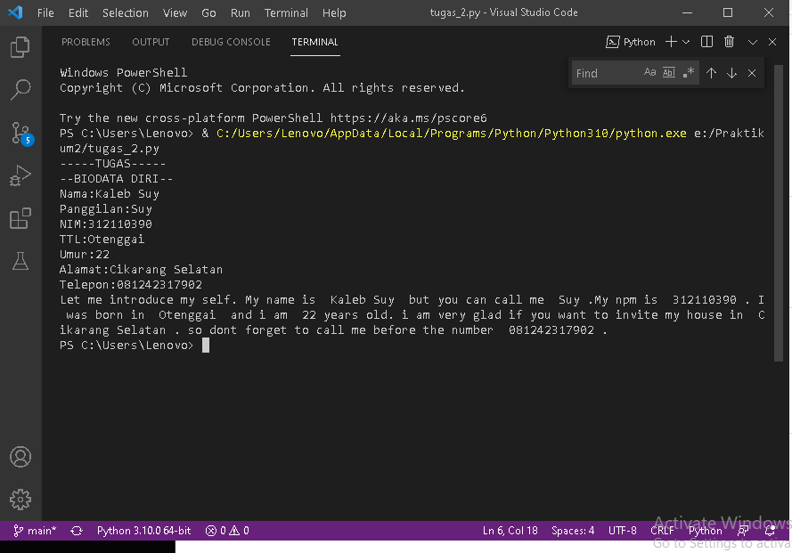
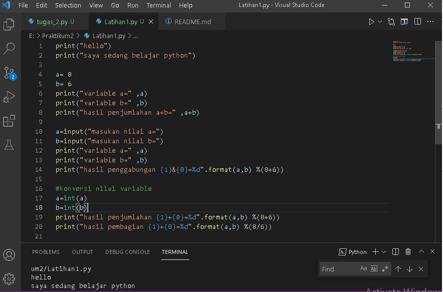
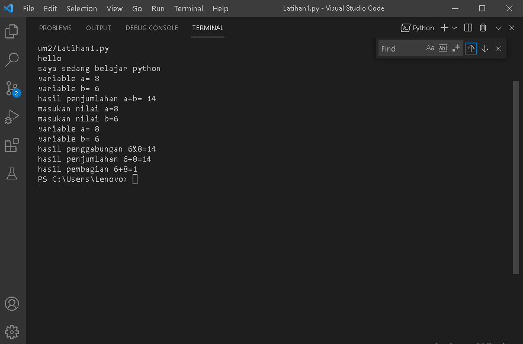

# Praktikum2
## Tugas Python

### Belajar bahasa pemrograman python
BIODATA DIRI
Ini adalah tampilan programnya

Ini adalah tampilan setelah run

## Latihan1

### Konveersi Nilai Variable
Ini adalah tampilan programnya

ini adalah hasil run
